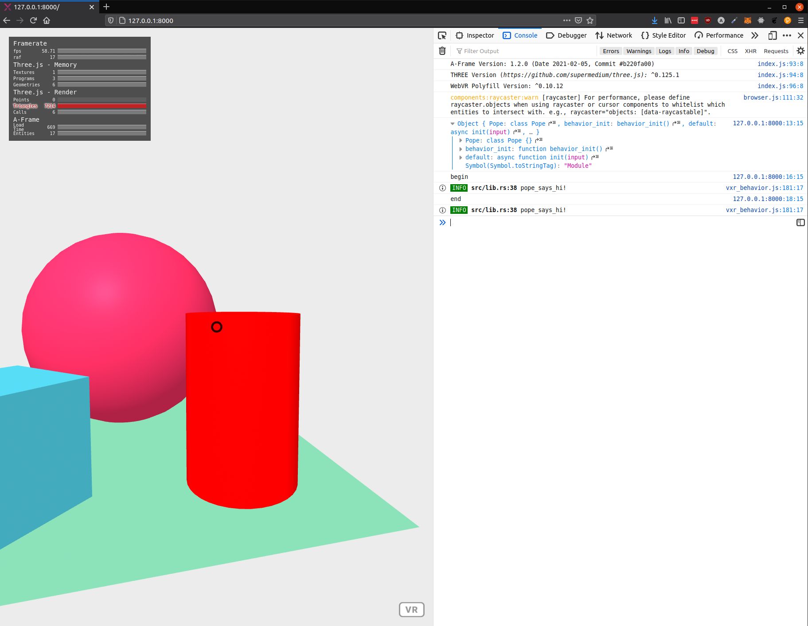

# Rust behaviors for VXR Spaces

Javascript can execute code from a Rust library

Install cargo tools:
```
cargo install wasm-pack
cargo install https
```

Build WASM module for browser:
```
wasm-pack build --target web
```

Test:
```
http
```

